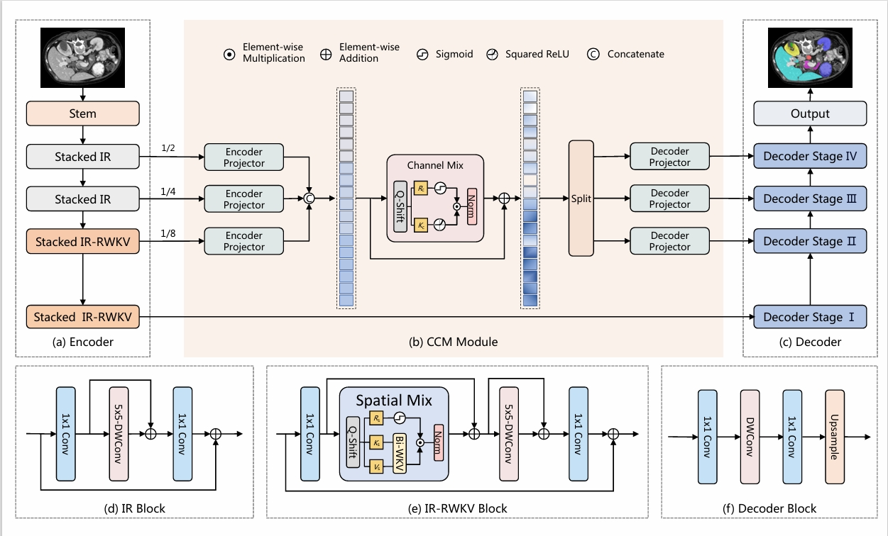
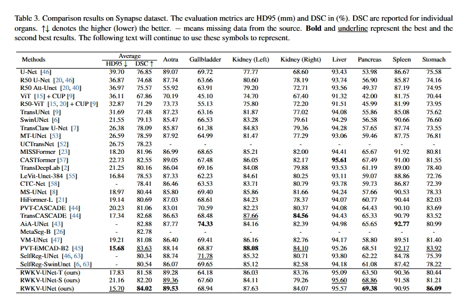
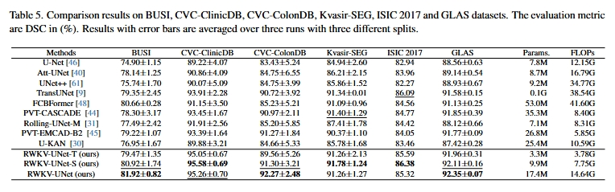
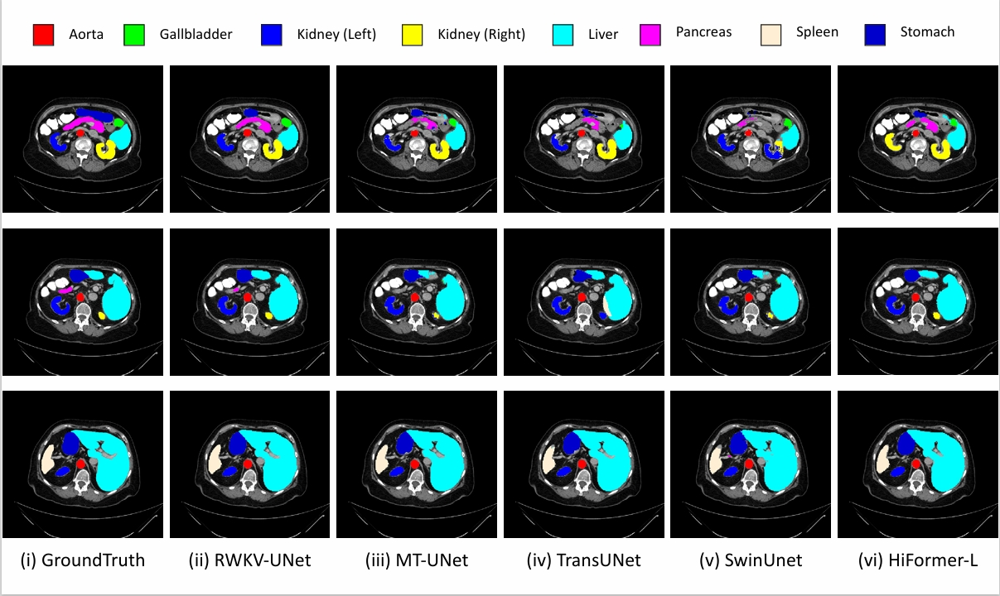

# RWKV-UNet
Official Pytorch implementation of the paper "RWKV-UNet: Improving UNet with Long-Range Cooperation for Effective Medical Image Segmentation" ( https://arxiv.org/abs/2501.08458) .  

## Architecture

<p align="center">

</p>

## Quantitative Results

<p align="center">


<p align="center">

</p>

<p align="center">

</p>


## Qualitative Results

<p align="center">

</p>


## Usage
### 1. Prepare data

Synapse (BTCV preprocessed data) and ACDC data are available at TransUNet's repo (https://github.com/Beckschen/TransUNet/tree/main). 

The directory structure of the whole project is as follows:

```
.
├── RWKVUNet
│   ├──datasets
│   │       └── dataset_*.py
│   ├──train.py
│   ├──test.py
│   ├──...
│   └──data
│        └── Synapse
│        │        ├── test_vol_h5
│        │        │   ├── case0001.npy.h5
│        │        │   └── *.npy.h5
│        │        └── train_npz
│        │          ├── case0005_slice000.npz
│        │          └── *.npz
│        │
│        └──ACDC
│             ├── ACDC_training_volumes
│             │      ├── patient100_frame01.h5
│             │      └── *.h5
│             └── ACDC_training_slices
│                    ├── patient100_frame13_slice_0.h5
│                    └── *.h5   

```
### 2. Environment

Please prepare an environment with python=3.9, and then use the command "pip install -r requirements.txt" for the dependencies.

### 3. Download weights

Pretrained weights for the encoder can be downloaded at (https://drive.google.com/drive/folders/1odF_NK5wYRkE0C3w9eoLUQEVbxefj66e?usp=sharing).

Checkponits for RWKV-UNet can be downloaded at (https://drive.google.com/drive/folders/19y_8Mzmw5u6Bg-iVfmh6-vRCBDdy149_?usp=sharing).


### 4. Train/Test

- Run the train script on synapse dataset. The batch size can be reduced to 12 or 6 to save memory (please also decrease the base_lr linearly), and both can reach similar performance.

```bash
python train.py --dataset Synapse --max_epochs 60 --base_lr 0.001 --img_size 224 --pretrained_path
```

- Run the test script on synapse dataset.

```bash
python test.py --dataset Synapse --max_epochs 60 --base_lr 0.001 --img_size 224
```
- You can also specify the weights for inference by yourself.

```bash
python test.py --dataset Synapse --path_specific 'ckpts/Synapse_base.pth'
```

## Citations

``` 
@misc{jiang2025rwkvunetimprovingunetlongrange,
      title={RWKV-UNet: Improving UNet with Long-Range Cooperation for Effective Medical Image Segmentation}, 
      author={Juntao Jiang and Jiangning Zhang and Weixuan Liu and Muxuan Gao and Xiaobin Hu and Xiaoxiao Yan and Feiyue Huang and Yong Liu},
      year={2025},
      eprint={2501.08458},
      archivePrefix={arXiv},
      primaryClass={eess.IV},
      url={https://arxiv.org/abs/2501.08458}, 
}
